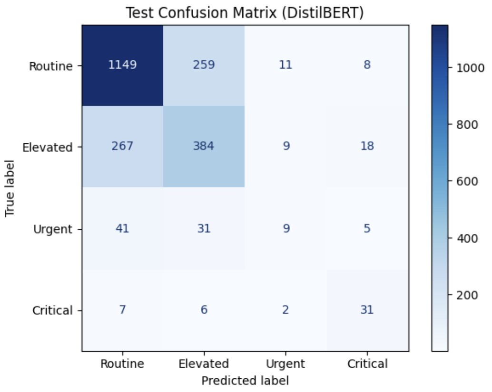
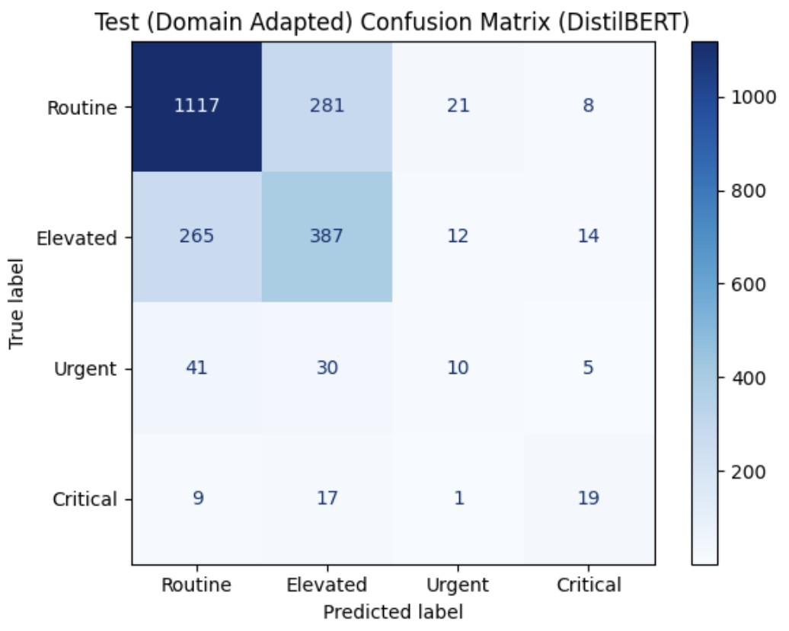

# Crisis Severity Detection with Cost-Sensitive Evaluation and DistilBERT
**Operational 4-level severity mapping + lexicon-guided oversampling for lightweight domain adaptation**

## Overview
This project builds an end-to-end pipeline for **crisis severity classification** from short, noisy social-media text
using the **CrisisMMD (Humanitarian subset)**. The work is motivated by operational triage settings where
**underestimating high-severity incidents is far more costly** than minor false alarms.

Core contributions:
- **Operational 4-level severity target** constructed by consolidating CrisisMMD’s original humanitarian labels
- **Model comparison**: TF–IDF + Logistic Regression vs. fine-tuned DistilBERT
- **Lightweight domain adaptation** via **lexicon-guided oversampling** (no architecture change)
- **Cost-sensitive evaluation** using an explicit **4×4 cost matrix** and risk-based metrics

---

## Problem Statement
This project addresses **crisis severity classification** from short, noisy social-media text.
It focuses on both **problem formulation** (severity target design) and **operational evaluation** (asymmetric risk).

The project is guided by three questions:

1. **Severity mapping:** How can CrisisMMD’s original humanitarian information-type labels be consolidated into an
   **operational 4-level severity scale** (Routine → Elevated → Urgent → Critical) suitable for triage-like prioritization?

2. **Model architecture:** Under severe class imbalance, how do classical keyword-driven baselines
   (TF–IDF + Logistic Regression) compare to contextual Transformer models (DistilBERT) in overall performance
   and rare high-severity detection?

3. **Domain adaptation:** Does lexicon-guided oversampling (lightweight domain adaptation without labeled in-domain data)
   meaningfully improve detection of high-severity (Urgent/Critical) cases under **cost-sensitive risk metrics**?

---

## Dataset
- **Dataset:** CrisisMMD (Humanitarian subset)
- **Content:** short English tweets annotated into **8 humanitarian information types**
- **Challenges observed in EDA:**
  - substantial **class imbalance** (dominance of `not_humanitarian` and `other_relevant_information`)
  - most tweets contain **fewer than ~20 words**
  - noisy text with abbreviations and high lexical variability

---

## Severity Scale Construction (Core Contribution)
CrisisMMD labels represent *information types*, not urgency. To enable triage-style decision-making,
the 8 humanitarian categories are mapped into **4 ordered severity levels**:

| Severity level | Original labels grouped |
|---|---|
| **Routine** | `not_humanitarian`, `other_relevant_information` |
| **Elevated** | `infrastructure_and_utility_damage`, `vehicle_damage`, `rescue_volunteering_or_donation_effort` |
| **Urgent** | `affected_individuals` |
| **Critical** | `injured_or_dead_people`, `missing_or_found_people` |

**Rationale:** The mapping is operationally inspired by multi-level urgency structures (e.g., medical evacuation precedence and clinical triage),
creating a decision-oriented severity target rather than a descriptive taxonomy.

**Protocol note (important for fairness):**
After mapping, the new severity variable is **merged back into the original train/validation/test splits**,
and all models are trained/evaluated on these **fixed mapped splits** for direct comparability.

---

## Methods

### 1) Baseline: TF–IDF + Logistic Regression
A classical keyword-driven baseline for crisis severity classification.

- Preprocessing: **lowercasing + tokenization**
- Features: **unigram + bigram TF–IDF**
- Vocabulary cap: **10,000**
- Minimum document frequency: **min_df = 2**
- Classifier: multinomial Logistic Regression
  - Optimizer: `lbfgs`
  - Class weighting: **inverse-frequency** to mitigate imbalance

---

### 2) Transformer: DistilBERT Fine-Tuning
A contextual baseline using DistilBERT as a 4-class sequence classifier.

- Tokenization: DistilBERT tokenizer
- Max sequence length: **64**
- Library: Hugging Face Transformers
- Hyperparameters:
  - weight decay: **0.01**
  - batch size: **16** (train), **32** (eval)
  - epochs: **3**

---

### 3) Lightweight Domain Adaptation: Lexicon-Guided Oversampling
This study tests a lightweight adaptation approach when **labeled in-domain data is not available**.

**Lexicon construction**
A defense/logistics-oriented lexicon is compiled from:
- publicly available military logistics doctrine (e.g., NATO AJP-4 / AJP-4.4, JP 4-0)
- humanitarian logistics literature

The lexicon contains **several dozen** domain-relevant terms spanning categories such as:
- logistics infrastructure (e.g., roads, bridges, ports)
- sustainment resources (e.g., fuel, supplies, depots)
- vehicles/equipment (e.g., trucks, armored vehicles)
- operational context terms (e.g., checkpoints, battalions)

**Tagging rule**
- A tweet is tagged **defense-like** if it contains **at least one lexicon term**.

**Oversampling rule**
- During training, each defense-like tweet is duplicated **three additional times** (i.e., oversampled ×4 total exposure).
- Validation and test sets remain **unchanged**.
- A fresh DistilBERT model is fine-tuned on the augmented training set using **the same hyperparameters** as the baseline.

This preserves architecture and label space while changing only the sampling distribution.

---

### 4) Cost-Sensitive Evaluation (Risk Matrix)
In operational settings, misclassifying a **Critical** event as **Routine** can be far worse than minor false alarms.
To encode this, the project defines a **4×4 cost matrix** \(C\) (rows = true label, columns = predicted label):

\[
C=
\begin{bmatrix}
0 & 1 & 3 & 4 \\
1 & 0 & 2 & 4 \\
3 & 2 & 0 & 2.5 \\
5 & 4 & 2.5 & 0
\end{bmatrix}
\]

- Highest penalties: **underestimating Urgent/Critical** (e.g., Critical → Routine)
- Lower but non-zero penalties: false alarms and mid-level confusions

Given confusion matrix counts \(n_{ij}\), the total and average risk are computed as:
\[
R_{\text{total}}=\sum_{i,j} n_{ij}C_{ij}, \quad R_{\text{avg}}=R_{\text{total}}/N
\]

Reported metrics include:
- Accuracy, Macro-F1, per-class precision/recall
- Confusion matrices
- **Average risk** under the cost matrix above (lower is better)

---

## Key Results

### Baseline comparison (architecture effect)
| Model | Accuracy | Macro-F1 | Avg Risk |
|---|---:|---:|---:|
| Logistic Regression (TF–IDF) | 0.646 | 0.472 | 0.585 |
| DistilBERT | 0.703 | 0.522 | 0.421 |

**DistilBERT outperforms** the TF–IDF baseline across standard metrics and cost-sensitive risk.
Gains are driven primarily by more stable predictions for majority classes (Routine/Elevated) and modest improvement for Critical,
while **Urgent recall remains low** in both models—highlighting persistent difficulty for rare high-severity detection.

---

### Domain adaptation effect (behavior shift vs. generalization)
| Model | Accuracy | Macro-F1 | Avg Risk |
|---|---:|---:|---:|
| DistilBERT | 0.703 | 0.522 | 0.421 |
| Domain-adapted DistilBERT (oversampling) | 0.685 | 0.476 | 0.461 |

Lexicon-guided oversampling **changes model behavior** (biasing predictions upward for defense-related language),
but does **not** generalize to improved overall performance on the CrisisMMD test distribution.
In particular, increased up-classification of Routine samples introduces additional mid-level confusion,
and **Critical recall decreases**, increasing high-impact errors under the operational cost matrix.

---

### Confusion Matrix Comparison (Test Set)
| DistilBERT (Baseline) | Domain-Adapted DistilBERT |
|---|---|
|  |  |

Confusion matrices reveal systematic confusion between adjacent severity levels (especially Routine–Elevated and Elevated–Urgent).
While lexicon-guided oversampling alters prediction patterns, it does not consistently reduce high-risk errors involving Urgent/Critical cases.

---

## Conclusion
- Fine-tuned DistilBERT improves crisis severity classification relative to TF–IDF Logistic Regression and reduces average cost-sensitive risk.
- Both approaches still struggle with **rare high-severity events (Urgent/Critical)**, indicating limitations of standard training on imbalanced crisis text.
- Lexicon-guided oversampling provides an interpretable, lightweight domain adaptation mechanism that **shifts behavior** but does not yield net gains on the test distribution.
- Cost-sensitive evaluation highlights that improvements in average risk do not always imply fewer worst-case underestimation errors, motivating refined cost-matrix design and stronger adaptation strategies (e.g., sample weighting, continual pretraining, multi-task learning).

---

## How to Reproduce
1. Open the notebook: `code/code.ipynb`
2. Run cells in order: preprocessing → severity mapping → training → evaluation
3. Figures used in the README are saved in `Figure/`
4. The full written report is available in `report/`

---

## Repository Structure
```text
├── Figure/     # Figures for EDA and results
├── code/       # Full annotated notebook pipeline (single source of truth)
├── report/     # Final project report (PDF)
└── README.md
